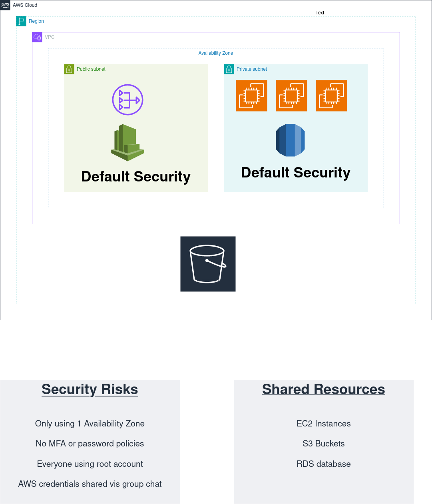
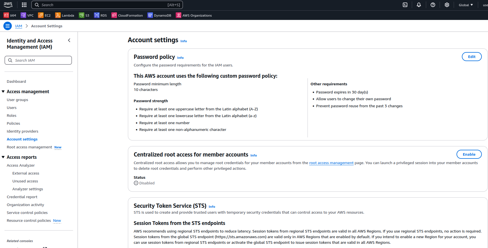
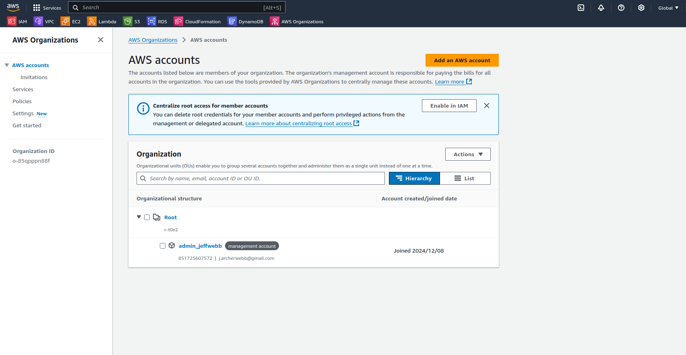
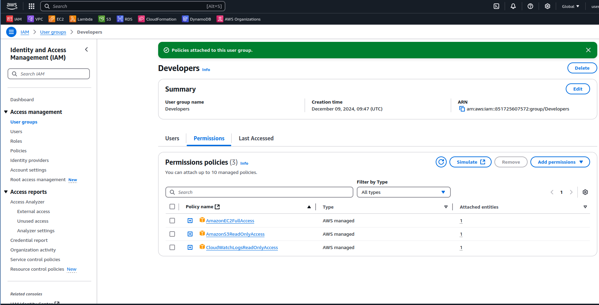
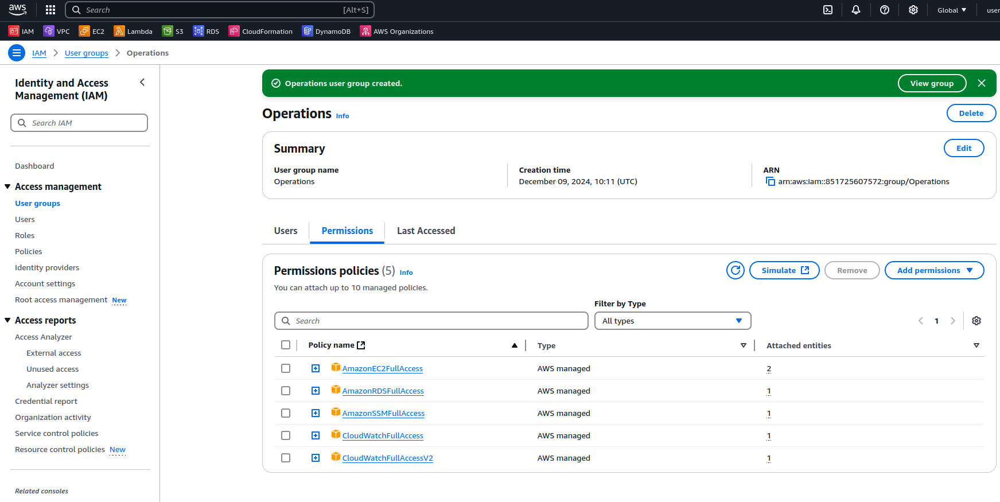

## New beginings

After a major misstep with a command, I ended up accidentally deleting most of the files on my PC. In the process,
I managed to salvage what I could for this repository. I had been considering starting over anyway, as some of the
earlier pushes had gone awry. As a Linux user with my configuration files not fully backed up, I had no choice but
to rebuild from scratch. I reinstalled Linux and began reconfiguring my software setup (fortunately, I run a minimal
and straightforward configuration). After two days of work, I’m nearly back to where I was. This marks the restart of
the project, and there are only a few files left that need to be rewritten. A valuable lesson learned!  

StartupCo, a fast-growing tech startup that recently launched their first product — a fitness tracking application.
They’ve been using AWS for three months, initially setting up their infrastructure quickly to meet launch deadlines.
Now that their product is live, they need to address their cloud security fundamentals. The company has 10 employees
who all currently share the AWS root account credentials to access and manage their cloud resources.
This practice started when they were moving quickly to launch, but now their CTO recognizes the security risks this poses.  

As I see there are a few potential risks within their security and IAM policies.  

## Team Structure & Access Needs

    4 Developers (need EC2 and S3 access)
    2 Operations (need full infrastructure access)
    1 Finance Manager (needs cost management access)
    3 Data Analysts (need read-only access to data resources)

With this information we need to ensure the account is secure immediately. The ‘root’ account or ‘admin’ account should only
be for the initial creation of the account and for any account related issues. From this ‘admin account, we need to create a 
new AWS account attached to this management account and from there create all the users and groups needed from within the companies 
guidelines. We would also need to make sure we have secure passwords implemented and MFA implemented to get an extra layer of security.
This need to be applied to all user accounts.  

Adding a strong password policy using the console, this can also be done using terraform or cdk.

## Team Structure & Access Needs

    4 Developers (need EC2 and S3 access)
    2 Operations (need full infrastructure access)
    1 Finance Manager (needs cost management access)
    3 Data Analysts (need read-only access to data resources)

These are the users that the company require, as this is a personal project, I cannot create all 10 users due to needing all email addresses,
etc, so will just be showing the creation of the user groups. But will be implementing all the changes in IaC (Infrastructure as code) using Terraform.  

So why do we need user groups?

By creating user group we can can, add or modify permission to many users at the same time to make it a quicker and more efficient process. 
This can all be done within the AWS console, so why use IaC and terraform? Again, for speed, efficiency and to eliminate human error. The 
console is great, but jumping from screen to screen humans can soon forget what they have clicked on and maybe even misclick allowing the 
incorrect permissions opening up more security risks . With just a few line of code we can create a quick, efficient and reliable structure 
that can be reused time and time again.  

## The first group is for the developers:

    EC2 management
    S3 access for application files
    CloudWatch logs viewing

In this group, I’ve been giving the information and decided to give full access to EC2, read only to S3 and CloudWatch logs as we always 
want to give Principle of Least Privilege. If ever unsure, always talk to the client/company to what access is require. It’s always best 
to give lower access then upgrade later.  

## Operations:

    Full EC2, CloudWatch access
    Systems Manager access
    RDS management

## Finance:

    Cost Explorer
    AWS Budgets
    Read-only resource access

## Analysts:

    Read-only S3 access
    Read-only database access

Each of these follow the Principle of Least Privilege and can always be changed in accordance with the companies requirements.
## Conclusion

Security is of upmost importance and securing the main management account and giving everyone their own accounts with their own permissions 
to the things they need to do their jobs is paramount for the security of the company.  
The security choices I have made have been done with the mindset of Principle of Least Privilege with the information that has been given. 
Doing this through the console is OK, but it is subject to more human error. Moving onward using CDK and Typescript or Terraform would be 
a better approach and one i will be implementing.
